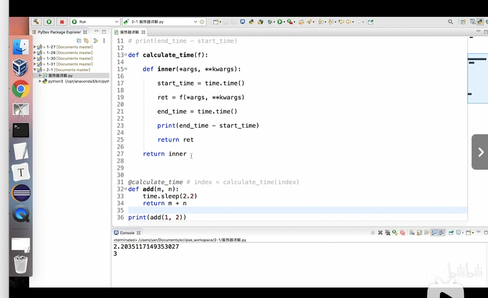

# Python生成器

```python-repl
def f():
    a = yield 1
    print(f"a={a}")
    b = yield "hello"
    print(f"b={b}")

# 创建生成器对象
ret = f()
# 启动生成器，执行到第一个yield
print(next(ret))
# 向生成器发送值，并继续执行到下一个yield
print(ret.send("he"))  # 修改为 ret.send("he")

```

# Python装饰器

```python
def calculate(f):
    def inner(*args, **kwargs):
        start_time = time.time()
        ret = f(*args, **kwargs)
        end_time = time.time()
        print(end_time-start_time)
        return ret
    return inner

@calculate
def cnt(x:int):
    sum = 0
    for i in range(x):
        sum += i
    return sum
print(cnt(1000000000))
```



# Python的位置参数和关键字参数

在Python中，函数参数可以分为两种类型：位置参数和关键字参数。

### 位置参数（Positional Arguments）

位置参数是指在调用函数时，参数的传递顺序必须与函数定义时参数的顺序相匹配。这些参数在函数定义中不包含任何特殊标识符。例如，在函数 `add(a, b)`中，`a`和 `b`都是位置参数。调用这个函数时，必须按照定义的顺序传递参数值，如 `add(1, 2)`。

### 关键字参数（Keyword Arguments）

关键字参数提供了一种更灵活的函数调用方式，允许函数调用时指定参数名称，而不必依赖于参数的位置。这在函数具有多个参数时特别有用，因为它可以提高代码的可读性。关键字参数在函数调用时使用参数名称来指定参数值，如 `add(a=1, b=2)`。

### 示例

让我们通过一个具体的例子来说明这两种参数的使用：

```python
def greet(first_name, last_name, greeting="Hello"):
    print(f"{greeting}, {first_name} {last_name}!")

# 使用位置参数调用函数
greet("John", "Doe")  # 输出: Hello, John Doe!

# 使用关键字参数调用函数，提高可读性
greet(first_name="John", last_name="Doe")  # 输出: Hello, John Doe!

# 使用关键字参数指定默认参数
greet(first_name="Jane", greeting="Hi")  # 输出: Hi, Jane Doe!
```

在这个例子中，`first_name`和 `last_name`是位置参数，而 `greeting`是一个关键字参数，它有一个默认值 `"Hello"`。当我们调用 `greet`函数时，可以使用位置参数按顺序传递值，也可以使用关键字参数通过参数名称指定值。关键字参数允许我们在调用函数时跳过一些参数（如果有默认值的话），并且可以不按顺序传递参数值，只要我们使用了参数名称。

# 函数闭包

```python-repl
def make_adder():
    z = 0
    def inner(y):
        nonlocal z
        z += y
        return z
    return inner  # 返回内部函数

add_5 = make_adder()
print(add_5(10))       # 输出:10
print(add_5(10))       # 输出:20
```

# Python引用类型变量

在 Python 中，引用类型变量意味着变量保存的是数据的引用（即指向该数据的内存地址），而不是数据的实际值。这种引用行为适用于所有可变类型，如列表、字典、集合等。理解引用类型变量的关键在于：对于这些类型的对象，直接赋值不会创建新对象，而是共享相同的内存地址。这会影响变量之间的关系，特别是在赋值和修改时。

### 常见的引用类型

1. **列表（List）** ：如 `a = [1, 2, 3]`，如果 `b = a`，则 `b` 和 `a` 指向同一内存地址，修改其中一个变量会影响另一个。
2. **字典（Dictionary）** ：如 `a = {'key': 'value'}`，`b = a` 会导致 `b` 和 `a` 指向同一对象。
3. **集合（Set）** ：同样的引用行为，赋值后共享相同内存地址

# itertools模块介绍

`itertools` 是 Python 的一个标准库模块，提供了许多迭代器生成工具，用于创建复杂的迭代器。以下是你提到的几个函数的用法介绍：

1. **accumulate(iterable, func, *, initial])**：

   - 返回一个迭代器，它计算迭代器 `it` 中元素的累积结果。
   - `func` 是一个可选的函数，用于计算累积值，默认为加法。
   - `initial` 是一个可选的初始值。
2. **combinations(iterable, r)**：

   - 返回一个迭代器，它生成 `iterable` 中所有长度为 `r` 的组合。
   - `r` 是组合中的元素数量。
3. **permutations(iterable, r=None)**：

   - 返回一个迭代器，它生成 `iterable` 中所有可能的长度为 `r` 的排列。
   - `r` 是排列中的元素数量，默认为 `iterable` 的长度。
4. **count(start=0, step=1)**

   - 返回一个迭代器，它生成一个无限的整数序列，从 `start` 开始，每次增加 `step`。
5. **product(*iterables, repeat=1)**：

   - 返回一个迭代器，它生成 `iterables` 中所有可能的笛卡尔积。
   - `repeat` 是一个可选参数，用于指定每个迭代器重复的次数。

以下是一些使用 `itertools` 模块中函数的示例：

```python
from itertools import accumulate, combinations, permutations, count, product

# 使用 accumulate 计算累积和
numbers = [1, 2, 3, 4, 5]
accumulated = list(accumulate(numbers))
print(accumulated)  # 输出 [1, 3, 6, 10, 15]

# 使用 combinations 生成组合
elements = ['A', 'B', 'C']
combos = list(combinations(elements, 2))
print(combos)  # 输出 [('A', 'B'), ('A', 'C'), ('B', 'C')]

# 使用 permutations 生成排列
perms = list(permutations(elements, 2))
print(perms)  # 输出 [('A', 'B'), ('A', 'C'), ('B', 'A'), ('B', 'C'), ('C', 'A'), ('C', 'B')]

# 使用 count 生成无限序列
counter = count(10)
for i in counter:
    if i > 15:
        break
    print(i)  # 输出 10, 11, 12, 13, 14, 15

# 使用 product 生成笛卡尔积
multipliers = [1, 2]
numbers = [3, 4]
products = list(product(multipliers, numbers))
print(products)  # 输出 [(1, 3), (1, 4), (2, 3), (2, 4)]
```

# bisect模块

`bisect` 是 Python 的一个内置模块，它提供了一个支持二分查找算法的类 `bisect`。这个模块可以用来维护一个有序的列表，并且可以高效地插入新元素，使得新元素插入后列表依然保持有序。以下是 `bisect` 模块的一些常用功能：

1. **bisect.bisect_left(a, x, lo=0, hi=len(a))**：

   - 在有序列表 `a` 中进行二分查找，找到元素 `x` 应该插入的位置，以保持列表有序。
   - `lo` 和 `hi` 分别是查找的起始和结束索引，默认为列表的开始和结束。
2. **bisect.bisect_right(a, x, lo=0, hi=len(a)) **：

   - 类似于 `bisect_left`，但是找到的是元素 `x` 应该插入的位置，使得所有小于 `x` 的元素都在 `x` 的左边，所有大于或等于 `x` 的元素都在 `x` 的右边。
3. **bisect.insort_left(a, x, lo=0, hi=len(a))**：

   - 在有序列表 `a` 中插入元素 `x`，插入位置由 `bisect_left` 确定，保持列表有序。
4. **bisect.insort_right(a, x, lo=0, hi=len(a))**：

   - 在有序列表 `a` 中插入元素 `x`，插入位置由 `bisect_right` 确定，保持列表有序。
5. **bisect.bisect(a, x, lo=0, hi=len(a))**：

   - 这是一个 `bisect_right` 的别名。

以下是一些使用 `bisect` 模块的示例：

```python
import bisect

# 创建一个有序列表
sorted_list = [1, 2, 4, 4, 5, 6, 8]

# 使用 bisect_left 查找元素应该插入的位置
index = bisect.bisect_left(sorted_list, 3)
print(index)  # 输出 2，因为 3 应该插入在索引 2 的位置

# 使用 insort_left 将元素插入到正确的位置
bisect.insort_left(sorted_list, 3)
print(sorted_list)  # 输出 [1, 2, 3, 4, 4, 5, 6, 8]

# 使用 bisect_right 查找元素应该插入的位置
index = bisect.bisect_right(sorted_list, 4)
print(index)  # 输出 4，因为 4 应该插入在索引 4 的位置

# 使用 insort_right 将元素插入到正确的位置
bisect.insort_right(sorted_list, 7)
print(sorted_list)  # 输出 [1, 2, 3, 4, 4, 5, 6, 7, 8]
```
