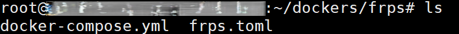
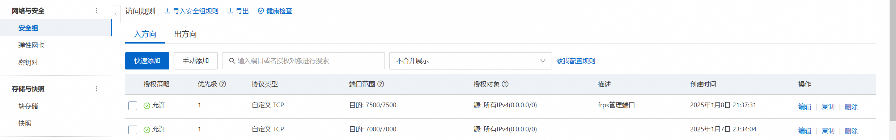
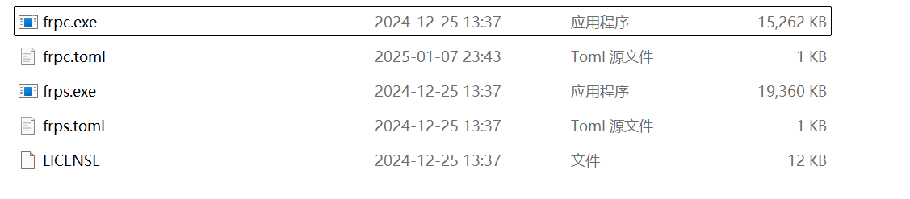
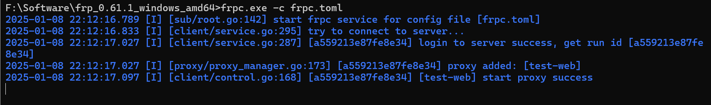

# 用阿里云云服务器实现内网穿透

## 反向代理工具介绍

`frp`（Fast Reverse Proxy）是一个高性能的反向代理工具，支持 TCP、UDP、HTTP 和 HTTPS 协议，广泛用于内网穿透、远程访问等场景。

**核心组件：**

* **frps**：服务端，运行在公网服务器（如阿里云服务器）上。
* **frpc** ：客户端，运行在内网机器上。

**支持的功能：**

* TCP/UDP 端口映射。
* HTTP/HTTPS 反向代理。
* 支持多用户、多端口映射。
* 支持身份验证和加密。

## 准备工作

* **一台公网服务器** ：如阿里云服务器，用于运行 `frps`。
* **一台内网机器** （也就是你的电脑）：需要暴露服务的本地机器，用于运行 `frpc`。
* 下载 [frp](https://github.com/fatedier/frp/releases/tag/v0.61.1)

## 安装配置步骤

### 在服务器上安装配置

为了隔离环境，服务器端在 Docker 上运行 `frps` 

1、安装 `docker` ，这里不过多赘述

2、创建一个文件夹用于放置运行 `frps` 的 `docker` 配置文件

3、在创建的文件夹下，新建如下两个文件：



4、在 `docker-compose.yml` 文件中写入如下内容：

```apache
version: '3'
services:
  frp:
    image: snowdreamtech/frps
    container_name: frps
    restart: always
    network_mode: host
    volumes:
      - ./frps.toml:/etc/frp/frps.toml
    environment:
      - FRP_CONFIG_FILE=/etc/frp/frps.toml
~                                           
```

5、在 `frps.toml` 文件中写入如下内容：

注意：所有 `***` 的内容都要自己设置

```apache
bindPort = 7000
#认证配置
[auth]
method = "token"
token = "***"
[webServer]
addr = "0.0.0.0"
port = 7500
user = "***"
password = "***"
[log]
to = "console"
level = "info"
~  
```

6、然后打开阿里云自己服务器的安全组，开放 `7000` 端口和 `7500` 端口，当然这里也可以设置成其他的。



7、运行 `docker compose up -d` 启动容器，此时你的服务端就设置完成了，接下来让我们配置客户端。

### 在windows上安装frp并配置

1、下载 `frp` 客户端，下载链接在[这里](https://github.com/fatedier/frp/releases/tag/v0.61.1)。选择	`windows` 版本的安装包。


2、编辑 `frpc.toml` 文件并写入以下内容：

```apache
serverAddr = "**.***.***.***"       # 服务器的地址
serverPort = 7000                   # 服务端的端口，确保服务端监听的端口和这里一致

auth.method = "token"               # 使用 token 认证方式
auth.token = "***"      # 确保这个 token 和服务端配置一致

log.to = "console"                  # 日志输出到控制台
log.level = "info"                  # 设置日志级别为 info，方便排查问题

[[proxies]]
name = "test-web"                   # 创建的代理的名字
type = "tcp"                        # 设置代理类型为 tcp
localIP = "localhost"               # 本地 IP 地址
localPort = ***                    # 本地端口
remotePort = 15050                  # 远程服务器的端口
```

**注意**：serverAdd 需要换成自己服务器的IP，`auth.token` 换成自己之前设置的，`localPort` 换成你本地服务的端口号，`remotePort` 同样也可以自己设置。同样在阿里云上开放这个 `remotePort` 端口.


3、启动本地服务，我这里是一个 `web` 项目。

4、在windows上启动 `frpc` 客户端，使用如下命令：


显示蓝色的字就说明你成功了。

5、在电脑上访问 `http://云服务器IP:15050` 就能看到在本地跑的web项目了，这样我们就实现了简单的内网穿透。
