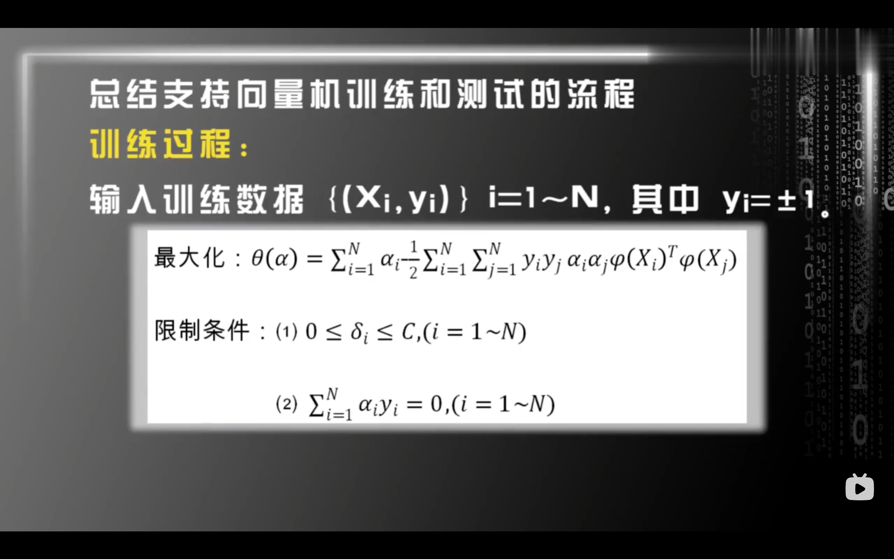
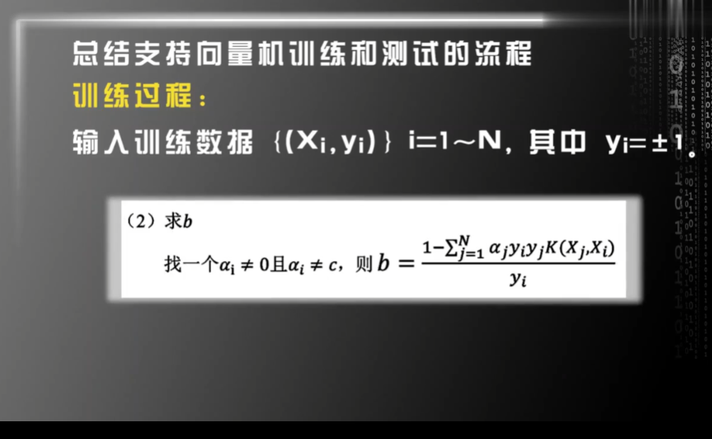
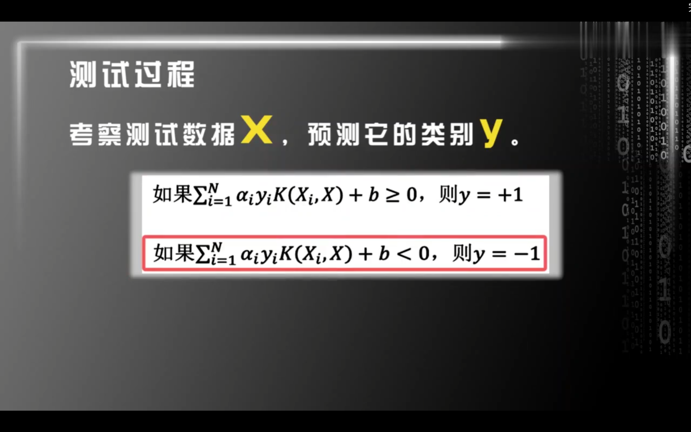

对偶问题是凸优化中的一个重要概念，用于将原始优化问题转化为另一个与之相关的问题。通过研究对偶问题，可以更好地理解原始问题的性质，并找到更高效的求解方法。即使你对凸优化不熟悉，也可以通过以下解释逐步理解对偶问题的定义和意义。

---

### 1. 原始问题（Primal Problem）

原始问题通常是一个带约束的优化问题，形式如下：

$$
\begin{aligned}
\text{最小化} \quad & f(x) \\
\text{约束} \quad & g_i(x) \leq 0, \quad i = 1, \ldots, m \\
& h_j(x) = 0, \quad j = 1, \ldots, l
\end{aligned}
$$

其中：

- $f(x)$ 是目标函数。
- $g_i(x)$ 是不等式约束。
- $h_j(x)$ 是等式约束。
- $x$ 是优化变量。

目标是找到满足所有约束的 $x$，使得 $f(x)$ 最小。

---

### 2. 拉格朗日函数（Lagrangian）

为了将对偶问题引入，我们首先构造拉格朗日函数。拉格朗日函数将目标函数和约束结合起来，引入拉格朗日乘数（对偶变量）：

$$
L(x, \lambda, \nu) = f(x) + \sum_{i=1}^m \lambda_i g_i(x) + \sum_{j=1}^l \nu_j h_j(x)
$$

其中：

- $\lambda_i$ 是不等式约束 $g_i(x) \leq 0$ 的拉格朗日乘数（$\lambda_i \geq 0$）。
- $\nu_j$ 是等式约束 $h_j(x) = 0$ 的拉格朗日乘数（$\nu_j$ 无符号限制）。

---

### 3. 对偶函数（Dual Function）

对偶函数是通过拉格朗日函数定义的，形式如下：

$$
D(\lambda, \nu) = \inf_{x} L(x, \lambda, \nu)
$$

这里：

- $\inf_{x}$ 表示对 $x$ 求极小值。
- $D(\lambda, \nu)$ 是拉格朗日函数关于 $x$ 的最小值，它是 $\lambda$ 和 $\nu$ 的函数。

对偶函数的一个重要性质是：**对偶函数是原始问题最优值的下界**。即对于任意 $\lambda \geq 0$ 和 $\nu$，有：

$$
D(\lambda, \nu) \leq f(x^*)
$$

其中 $x^*$ 是原始问题的最优解。

---

### 4. 对偶问题（Dual Problem）

对偶问题的目标是最大化对偶函数 $D(\lambda, \nu)$，同时满足 $\lambda \geq 0$：

$$
\begin{aligned}
\text{最大化} \quad & D(\lambda, \nu) \\
\text{约束} \quad & \lambda_i \geq 0, \quad i = 1, \ldots, m
\end{aligned}
$$

对偶问题的解 $(\lambda^*, \nu^*)$ 提供了原始问题最优值的下界。

---

### 5. 强对偶性（Strong Duality）

在某些条件下（如凸优化问题且满足Slater条件），原始问题和对偶问题的最优值相等，即：

$$
f(x^*) = D(\lambda^*, \nu^*)
$$

这时，我们称强对偶性成立。强对偶性是凸优化中的一个重要性质，它允许我们通过对偶问题来求解原始问题。

---

### 6. 对偶问题的意义

- **提供下界**：对偶问题的最优值是原始问题最优值的下界，可以用来评估原始问题的解。
- **简化问题**：对偶问题有时比原始问题更容易求解，尤其是在约束较多的情况下。
- **理论分析**：对偶问题揭示了原始问题的深层结构，如**KKT**条件和对偶间隙。

---

### 7. 简单例子

考虑一个简单的凸优化问题：

$$
\begin{aligned}
\text{最小化} \quad & x^2 \\
\text{约束} \quad & x \geq 1
\end{aligned}
$$

拉格朗日函数为：

$$
L(x, \lambda) = x^2 + \lambda (1 - x)
$$

对偶函数为：

$$
D(\lambda) = \inf_{x} L(x, \lambda)
$$

通过求导，可以得到 $x = \frac{\lambda}{2}$，代入后：

$$
D(\lambda) = \frac{\lambda^2}{4} + \lambda \left(1 - \frac{\lambda}{2}\right) = \lambda - \frac{\lambda^2}{4}
$$

对偶问题是最大化 $D(\lambda)$，解为 $\lambda^* = 2$，此时 $D(\lambda^*) = 1$，与原始问题的最优值 $f(x^*) = 1$ 相等，满足强对偶性。

---

### 总结

对偶问题是通过拉格朗日函数构造的，目标是最大化对偶函数。它在凸优化中具有重要意义，能够提供原始问题的下界，并在某些条件下与原始问题等价。即使你对凸优化不熟悉，也可以通过拉格朗日函数和对偶函数的概念逐步理解对偶问题的定义和作用。

支持向量机（SVM）的原问题是一个带约束的凸优化问题。通过拉格朗日对偶性，可以将其转换为对偶问题。以下是详细的转换过程，使用 `$ $` 表示行内公式，`$$ $$` 表示独立公式。

---

### 1. SVM 的原问题

SVM 的原问题是找到一个最大间隔超平面，形式如下：

$$
\begin{aligned}
\text{最小化} \quad & \frac{1}{2} \|w\|^2 \\
\text{约束} \quad & y_i (w^T x_i + b) \geq 1, \quad i = 1, \ldots, n
\end{aligned}
$$

其中：

- $w$ 是超平面的法向量。
- $b$ 是偏置项。
- $x_i$ 是第 $i$ 个样本。
- $y_i$ 是第 $i$ 个样本的标签（$y_i \in \{-1, 1\}$）。
- $\|w\|^2$ 是 $w$ 的 $L_2$ 范数的平方，表示间隔的倒数。

---

### 2. 构造拉格朗日函数

引入拉格朗日乘数 $\alpha_i$（$\alpha_i \geq 0$），构造拉格朗日函数：

$$
L(w, b, \alpha) = \frac{1}{2} \|w\|^2 - \sum_{i=1}^n \alpha_i \left[ y_i (w^T x_i + b) - 1 \right]
$$

这里：

- $\alpha_i$ 是每个约束对应的拉格朗日乘数。
- 拉格朗日函数将目标函数和约束结合起来。

---

### 3. 对偶问题的定义

对偶问题的目标是通过拉格朗日函数，最大化关于 $\alpha$ 的下界。具体步骤如下：

#### （1）对 $w$ 和 $b$ 求偏导并令其为零

首先，对 $w$ 和 $b$ 求偏导，并令其为零：

$$
\frac{\partial L}{\partial w} = w - \sum_{i=1}^n \alpha_i y_i x_i = 0 \quad \Rightarrow \quad w = \sum_{i=1}^n \alpha_i y_i x_i
$$

$$
\frac{\partial L}{\partial b} = -\sum_{i=1}^n \alpha_i y_i = 0 \quad \Rightarrow \quad \sum_{i=1}^n \alpha_i y_i = 0
$$

#### （2）将结果代入拉格朗日函数

将 $w = \sum_{i=1}^n \alpha_i y_i x_i$ 和 $\sum_{i=1}^n \alpha_i y_i = 0$ 代入拉格朗日函数，得到对偶函数：

$$
\begin{aligned}
L(w, b, \alpha) &= \frac{1}{2} \|w\|^2 - \sum_{i=1}^n \alpha_i \left[ y_i (w^T x_i + b) - 1 \right] \\
&= \frac{1}{2} \left( \sum_{i=1}^n \alpha_i y_i x_i \right)^T \left( \sum_{j=1}^n \alpha_j y_j x_j \right) - \sum_{i=1}^n \alpha_i y_i w^T x_i - b \sum_{i=1}^n \alpha_i y_i + \sum_{i=1}^n \alpha_i \\
&= \frac{1}{2} \sum_{i=1}^n \sum_{j=1}^n \alpha_i \alpha_j y_i y_j x_i^T x_j - \sum_{i=1}^n \sum_{j=1}^n \alpha_i \alpha_j y_i y_j x_i^T x_j + \sum_{i=1}^n \alpha_i \\
&= \sum_{i=1}^n \alpha_i - \frac{1}{2} \sum_{i=1}^n \sum_{j=1}^n \alpha_i \alpha_j y_i y_j x_i^T x_j
\end{aligned}
$$

#### （3）对偶问题

对偶问题是最大化对偶函数，同时满足约束条件：

$$
\begin{aligned}
\text{最大化} \quad & D(\alpha) = \sum_{i=1}^n \alpha_i - \frac{1}{2} \sum_{i=1}^n \sum_{j=1}^n \alpha_i \alpha_j y_i y_j x_i^T x_j \\
\text{约束} \quad & \alpha_i \geq 0, \quad i = 1, \ldots, n \\
& \sum_{i=1}^n \alpha_i y_i = 0
\end{aligned}
$$

---

### 4. 对偶问题的解

对偶问题的解 $\alpha^*$ 可以用来表示原始问题的解 $w^*$ 和 $b^*$：

- $w^* = \sum_{i=1}^n \alpha_i^* y_i x_i$。
- $b^*$ 可以通过支持向量（$\alpha_i^* > 0$ 对应的样本）计算得到。

---

### 5. 支持向量的意义

- 支持向量是 $\alpha_i^* > 0$ 对应的样本，它们决定了超平面的位置。
- 其他样本（$\alpha_i^* = 0$）对超平面没有影响。

---

### 总结

SVM 的原问题通过拉格朗日对偶性转换为对偶问题，具体步骤包括：

1. 构造拉格朗日函数。
2. 对 $w$ 和 $b$ 求偏导并令其为零。
3. 将结果代入拉格朗日函数，得到对偶问题。
4. 对偶问题的解可以用来表示原始问题的解。

对偶问题的形式更简单，且可以通过核函数扩展到非线性分类问题。

$$
\begin{aligned}
\text{最小化:} \quad & \frac{1}{2}\left\|\omega\right\|^{2} + C\sum_{i=1}^{N}\delta_{i} \quad \text{或} \quad \frac{1}{2}\left\|\omega\right\|^{2} + C\sum_{i=1}^{N}\delta_{i}^{2} \\
\text{限制条件:} \quad & \delta_{i} \geq 0 \quad (i = 1, 2, \ldots, N) \\
& y_{i}\left[\omega^{T}\varphi\left(X_{i}\right) + b\right] \geq 1 - \delta_{i} \quad (i = 1 \sim N)
\end{aligned}
$$

$$
\begin{aligned}
\text{最小化:} \quad & \frac{1}{2}\left\|\omega\right\|^{2} - C\sum_{i=1}^{N}\delta_{i} \quad \text{或} \quad \frac{1}{2}\left\|\omega\right\|^{2}+C\sum_{i=1}^{N}\delta_{i}^{2} \\
& \uparrow\text{ 情况1} \quad \quad \quad \quad \quad \quad \uparrow\text{ 情况2} \\
\text{限制条件:} \quad & ①\delta_{i}\leq0 \quad (i = 1 \sim N) \\
& ②1+\delta_{i}-y_{i}\omega^{T}\varphi\left(X_{i}\right)-y_{i}b\leq0 \quad (i = 1 \sim N)
\end{aligned}
$$

$$
\begin{aligned}
 & \text{最大化:}\theta(\alpha)=\sum_{i=1}^{N}\alpha_{i}-\frac{1}{2}\sum_{i=1}^{N}\sum_{j=1}^{N}y_{i}y_{j}\alpha_{i}\alpha_{j}\varphi(X_{i})^{\mathrm{T}}\varphi(X_{j}) \\
 & \text{限制条件:}(1)0\leq\delta_{i}\leq C,(i=1\sim N) \\
 & (2)\sum_{i=1}^{N}\alpha_{i}y_{i}=0,(i=1\sim N)
\end{aligned}
$$

